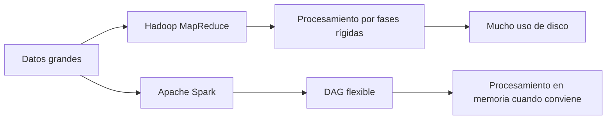
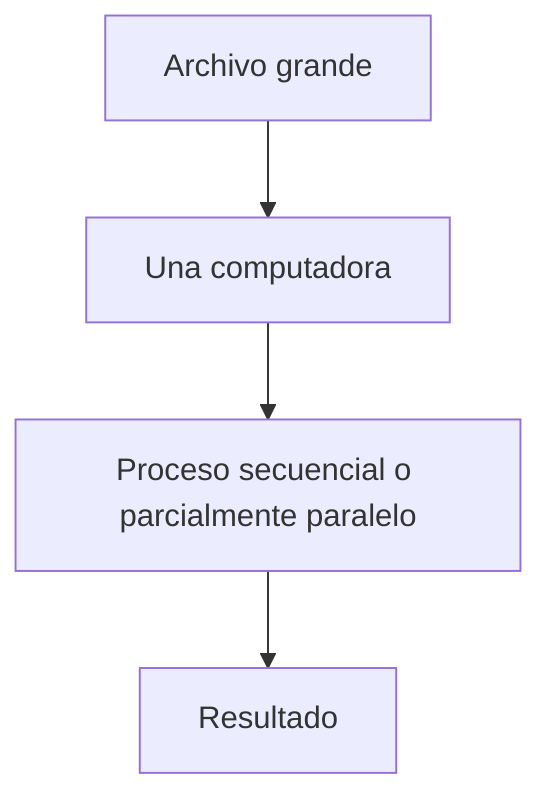
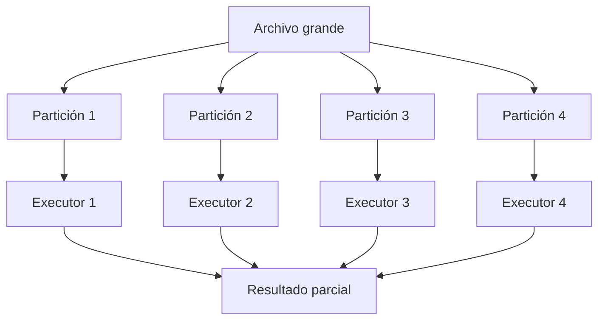
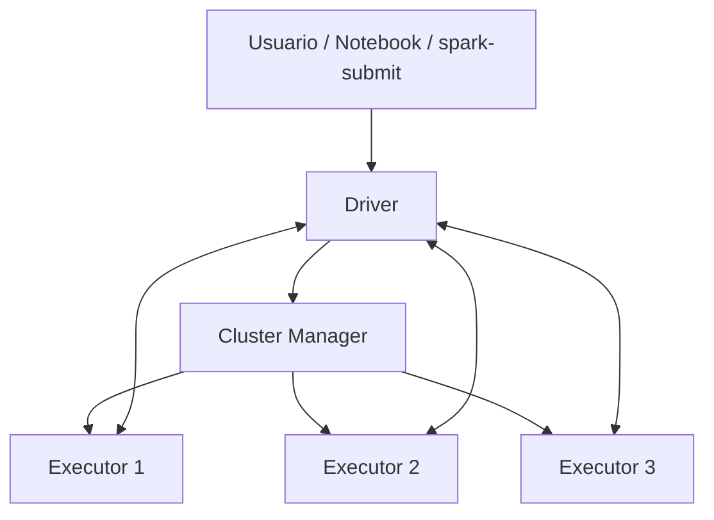
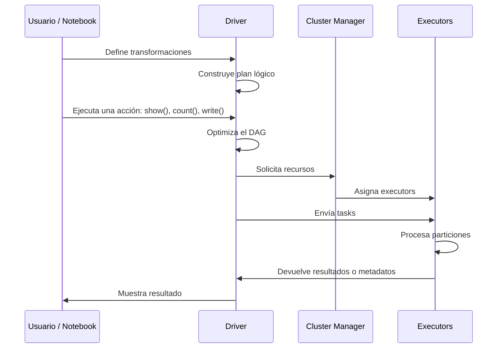
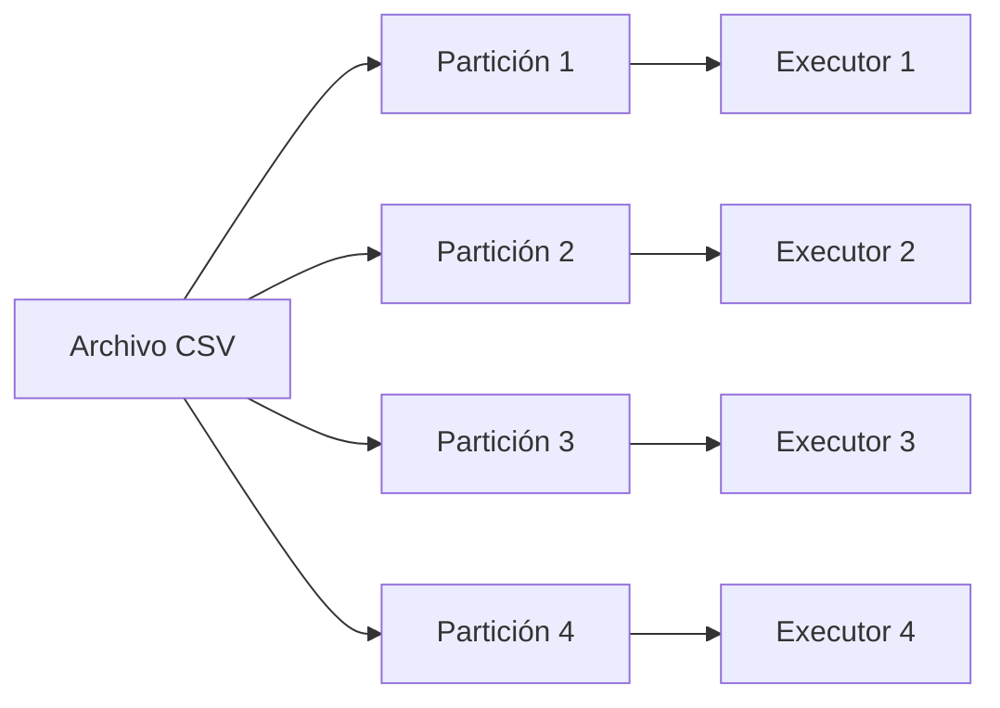
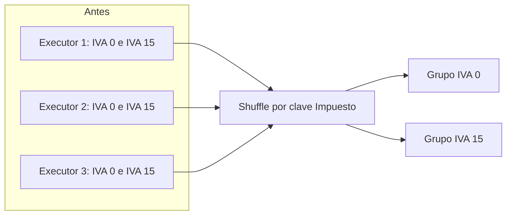
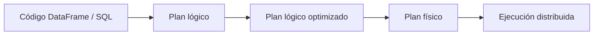
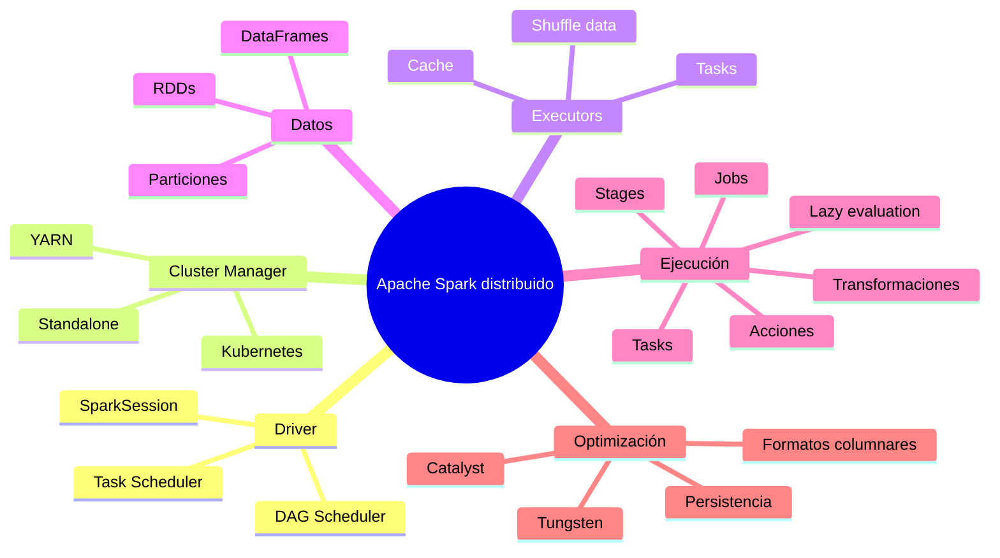

# Apache Spark en modo distribuido

## Arquitectura, ejecución y laboratorio con Ubuntu Multipass + Apache Zeppelin

**Material de apoyo para estudiantes universitarios de programación y análisis de datos**  
**Versión del documento:** 1.0  
**Fecha:** julio de 2026


---

## Índice

1. [Propósito del documento](#1-propósito-del-documento)
2. [Qué es Apache Spark](#2-qué-es-apache-spark)
3. [Por qué Spark trabaja bien en modo distribuido](#3-por-qué-spark-trabaja-bien-en-modo-distribuido)
4. [Arquitectura general](#4-arquitectura-general)
5. [Componentes principales](#5-componentes-principales)
6. [Cómo se ejecuta una aplicación Spark](#6-cómo-se-ejecuta-una-aplicación-spark)
7. [Transformaciones, acciones y evaluación perezosa](#7-transformaciones-acciones-y-evaluación-perezosa)
8. [DAG, jobs, stages y tasks](#8-dag-jobs-stages-y-tasks)
9. [Particiones](#9-particiones)
10. [Shuffle](#10-shuffle)
11. [Memoria, cache y persistencia](#11-memoria-cache-y-persistencia)
12. [Modos de despliegue](#12-modos-de-despliegue)
13. [Cluster managers](#13-cluster-managers)
14. [Spark SQL, DataFrames y Catalyst](#14-spark-sql-dataframes-y-catalyst)
15. [Apache Zeppelin como entorno de trabajo](#15-apache-zeppelin-como-entorno-de-trabajo)
16. [Caso práctico orientativo](#16-caso-práctico-orientativo)
17. [Instalación de Apache Spark y Apache Zeppelin con Ubuntu Multipass](#17-instalación-de-apache-spark-y-apache-zeppelin-con-ubuntu-multipass)
18. [Pruebas finales del laboratorio](#18-pruebas-finales-del-laboratorio)
19. [Buenas prácticas](#19-buenas-prácticas)
20. [Resumen final](#20-resumen-final)
21. [Referencias](#21-referencias)

---

## 1. Propósito del documento

Este documento explica cómo trabaja **Apache Spark en modo distribuido**. El objetivo no es solo instalar la herramienta, sino comprender qué ocurre internamente cuando un programa Spark procesa datos usando varios núcleos, varios procesos o varios nodos de un cluster.

Al finalizar, el estudiante debería poder responder preguntas como:

- ¿Qué diferencia existe entre ejecutar Spark en modo local y en modo cluster?
- ¿Qué papel cumplen el **Driver**, los **Executors** y el **Cluster Manager**?
- ¿Por qué Spark divide los datos en particiones?
- ¿Qué son un **Job**, un **Stage** y una **Task**?
- ¿Por qué algunas operaciones son costosas?
- ¿Qué es el **shuffle** y por qué debe controlarse?
- ¿Cómo instalar un laboratorio funcional con **Ubuntu Multipass**, **Apache Spark** y **Apache Zeppelin**?

> **Idea central:** Spark no es simplemente una librería para leer CSV. Es un motor de procesamiento distribuido capaz de transformar grandes volúmenes de datos mediante ejecución paralela, planificación de tareas, optimización de consultas y tolerancia a fallos.

---

## 2. Qué es Apache Spark

Apache Spark es un motor unificado de analítica para procesamiento de datos a gran escala. Su documentación oficial lo define como un motor para procesamiento distribuido que ofrece APIs de alto nivel en **Scala, Java, Python y R**, además de herramientas como **Spark SQL**, **Structured Streaming**, **MLlib**, **GraphX** y la **pandas API on Spark**.

Spark se usa para:

| Área | Ejemplos |
|---|---|
| Procesamiento batch | Limpieza de archivos CSV, JSON, Parquet, logs |
| Analítica SQL | Consultas sobre grandes volúmenes de datos |
| Machine Learning | Entrenamiento distribuido con MLlib |
| Streaming | Procesamiento incremental de eventos |
| ETL | Extracción, transformación y carga de datos |
| Ciencia de datos | Preparación de datos para análisis y visualización |

### 2.1. De Hadoop MapReduce a Spark

Antes de Spark, Hadoop MapReduce fue una de las tecnologías más conocidas para procesar grandes volúmenes de datos. MapReduce permitió distribuir el trabajo, pero tenía una limitación importante: muchos procesos intermedios escribían y leían desde disco. Spark mejoró este enfoque usando procesamiento en memoria cuando es posible y permitiendo construir grafos de ejecución más flexibles.



### 2.2. Lenguajes soportados

Spark puede usarse desde diferentes lenguajes:

```text
Scala  -> API nativa muy cercana al motor de Spark
Java   -> API robusta para ecosistemas empresariales
Python -> PySpark, muy usado en ciencia de datos
SQL    -> Consultas declarativas sobre DataFrames y vistas
R      -> Soporte disponible, aunque R está marcado como deprecated en Spark 4.x
```

Para prácticas universitarias con Zeppelin, Scala resulta especialmente útil porque permite trabajar cerca del modelo original de Spark y aprovechar la integración del intérprete Spark en notebooks.

---

## 3. Por qué Spark trabaja bien en modo distribuido

Spark está diseñado para dividir un problema grande en problemas más pequeños. Cada fragmento puede ejecutarse en paralelo sobre diferentes núcleos o máquinas.

### 3.1. Procesamiento tradicional

En un programa tradicional, los datos suelen procesarse en una sola máquina:



Este enfoque puede ser suficiente para archivos pequeños, pero se complica cuando los datos superan la memoria, el disco o la capacidad de CPU de una sola máquina.

### 3.2. Procesamiento distribuido

En Spark, el trabajo se reparte:



### 3.3. Tres ideas fundamentales

| Concepto | Descripción | Ejemplo |
|---|---|---|
| Distribución | Los datos se dividen entre varios procesos o nodos | Un CSV se divide en particiones |
| Paralelismo | Varias tareas se ejecutan al mismo tiempo | Cada executor procesa una partición |
| Tolerancia a fallos | Spark puede recomputar datos perdidos usando el linaje | Si falla una task, puede reintentarse |

> **Concepto clave:** Spark no mueve todo el archivo hacia un único proceso. Intenta llevar el cálculo hacia las particiones de datos.

---

## 4. Arquitectura general

La arquitectura distribuida de Spark puede entenderse como una conversación entre tres grandes actores:

1. **Driver**: coordina la aplicación.
2. **Cluster Manager**: asigna recursos.
3. **Executors**: ejecutan tareas y almacenan datos en memoria o disco.


### 4.1. Vista simplificada



### 4.2. Una analogía sencilla

Imaginemos una fábrica:

| Spark | Analogía |
|---|---|
| Driver | Jefe de producción |
| Cluster Manager | Oficina que asigna personal y máquinas |
| Executors | Trabajadores especializados |
| Tasks | Órdenes de trabajo concretas |
| Particiones | Lotes de materia prima |
| Resultado | Producto final |

El Driver no procesa todos los datos. Su trabajo principal es **planificar, coordinar y recibir resultados**.

---

## 5. Componentes principales

### 5.1. Driver

El Driver es el proceso principal de una aplicación Spark. En él se crea la `SparkSession` y desde allí se construyen las operaciones sobre RDDs, DataFrames o Datasets.

Responsabilidades del Driver:

- Crear la sesión de Spark.
- Interpretar el programa del usuario.
- Construir el plan lógico de ejecución.
- Solicitar recursos al cluster manager.
- Dividir el trabajo en jobs, stages y tasks.
- Enviar tasks a los executors.
- Recolectar resultados cuando una acción lo requiere.

Ejemplo en Scala:

```scala
val spark = SparkSession.builder()
  .appName("EjemploDistribuido")
  .master("local[*]")
  .getOrCreate()
```

En Zeppelin, normalmente `spark` ya está disponible gracias al intérprete de Spark.

### 5.2. SparkSession

`SparkSession` es el punto de entrada moderno para trabajar con Spark SQL, DataFrames y Datasets.

```scala
val df = spark.read
  .option("header", "true")
  .csv("/data/compras-2024.csv")
```

### 5.3. Cluster Manager

El Cluster Manager administra los recursos disponibles. Spark puede trabajar con diferentes administradores:

- Spark Standalone
- Hadoop YARN
- Kubernetes
- Mesos, aunque hoy se usa mucho menos

El cluster manager no decide el plan de ejecución de Spark. Su función es proporcionar recursos: CPU, memoria y procesos.

### 5.4. Executors

Los Executors son procesos que se ejecutan en los nodos de trabajo. Cada executor puede ejecutar varias tasks y almacenar particiones en memoria.

Responsabilidades:

- Ejecutar tasks.
- Mantener datos en cache o persistencia.
- Escribir resultados parciales.
- Comunicar el estado al Driver.

### 5.5. Tasks

Una task es la unidad mínima de ejecución. Normalmente una task procesa una partición.

```text
1 partición de datos  ->  1 task  ->  1 executor
```

No siempre existe una correspondencia perfecta uno a uno, pero es una buena aproximación para entender el modelo.

---

## 6. Cómo se ejecuta una aplicación Spark

Cuando escribimos un programa como este:

```scala
val compras = spark.read
  .option("header", "true")
  .csv("/data/compras-2024.csv")

val resumen = compras
  .filter($"Total" > 0)
  .groupBy("Impuesto")
  .sum("Total")

resumen.show()
```

Spark no ejecuta inmediatamente cada línea. Primero construye un plan. La ejecución real se activa cuando aparece una acción como `show`, `count`, `collect`, `write`, etc.

### 6.1. Flujo general



### 6.2. Lo importante

Spark separa la definición del cálculo de su ejecución. Esto permite optimizar el plan completo antes de ejecutarlo.

---

## 7. Transformaciones, acciones y evaluación perezosa

### 7.1. Transformaciones

Una transformación crea un nuevo DataFrame, Dataset o RDD a partir de otro, pero no ejecuta inmediatamente el cálculo.

Ejemplos:

| Transformación | Descripción |
|---|---|
| `select` | Selecciona columnas |
| `filter` / `where` | Filtra filas |
| `withColumn` | Crea o modifica columnas |
| `groupBy` | Agrupa datos |
| `join` | Une DataFrames |
| `orderBy` | Ordena datos |
| `repartition` | Redistribuye particiones |
| `coalesce` | Reduce particiones |

### 7.2. Acciones

Una acción obliga a Spark a ejecutar el plan.

| Acción | Descripción | Riesgo |
|---|---|---|
| `show()` | Muestra filas | Bajo |
| `count()` | Cuenta registros | Medio |
| `take(n)` | Trae n filas al Driver | Bajo si n es pequeño |
| `collect()` | Trae todo al Driver | Alto |
| `write` | Escribe resultados | Depende del volumen |

> **Advertencia:** `collect()` puede saturar la memoria del Driver si el DataFrame es grande. En docencia es común usarlo con datos pequeños, pero en producción debe evitarse salvo que se tenga certeza del tamaño.

### 7.3. Lazy evaluation

La evaluación perezosa significa que Spark espera hasta tener una acción para ejecutar. Esto permite optimizar.

```scala
val datos = spark.read.option("header", "true").csv("compras.csv")
val filtrado = datos.filter($"Total" > 10)
val resumen = filtrado.groupBy("Impuesto").count()

// Aquí se ejecuta realmente
resumen.show()
```

---

## 8. DAG, jobs, stages y tasks


### 8.1. DAG

DAG significa **Directed Acyclic Graph**. Es un grafo dirigido sin ciclos. Spark usa este grafo para representar el flujo de operaciones.


### 8.2. Job

Un **job** se crea cuando se ejecuta una acción. Por ejemplo:

```scala
resumen.count()
```

crea un job.

### 8.3. Stage

Un **stage** es una parte del job que puede ejecutarse sin necesidad de redistribuir datos entre nodos. Cuando aparece un shuffle, Spark suele dividir el job en nuevos stages.

### 8.4. Task

Una **task** es el trabajo concreto que se envía a un executor. Si un stage tiene 8 particiones, probablemente tendrá 8 tasks.

```text
Job
 ├── Stage 1
 │    ├── Task 1
 │    ├── Task 2
 │    └── Task 3
 └── Stage 2
      ├── Task 4
      ├── Task 5
      └── Task 6
```

---

## 9. Particiones

Las particiones son fragmentos lógicos de un conjunto de datos. Spark divide los datos para procesarlos en paralelo.



### 9.1. Por qué importan

Si hay pocas particiones, no se aprovecha el paralelismo. Si hay demasiadas, Spark pierde tiempo administrando tareas muy pequeñas.

| Situación | Consecuencia |
|---|---|
| Muy pocas particiones | Poca concurrencia |
| Demasiadas particiones | Sobrecarga de planificación |
| Particiones desbalanceadas | Algunos executors terminan rápido y otros quedan saturados |

### 9.2. Consultar particiones

```scala
val df = spark.read.option("header", "true").csv("compras-2024.csv")

printf("Número de particiones: %d%n", df.rdd.getNumPartitions)
```

### 9.3. repartition y coalesce

```scala
val masParticiones = df.repartition(8)
val menosParticiones = df.coalesce(2)
```

- `repartition(n)` redistribuye datos y puede generar shuffle.
- `coalesce(n)` reduce particiones, usualmente con menor costo cuando se disminuye el número de particiones.

---

## 10. Shuffle

El shuffle ocurre cuando Spark necesita mover datos entre executors para completar una operación.

Operaciones típicas que pueden generar shuffle:

- `groupBy`
- `join`
- `distinct`
- `orderBy`
- `repartition`

### 10.1. Ejemplo conceptual

Supongamos que tenemos compras distribuidas en tres executors y queremos agrupar por tipo de impuesto.



### 10.2. Por qué es costoso

El shuffle puede implicar:

- Escritura temporal en disco.
- Transferencia de datos por red.
- Serialización y deserialización.
- Espera entre stages.
- Mayor consumo de memoria.

> **Regla práctica:** no todo shuffle es malo. Muchas tareas analíticas necesitan agrupar, unir o ordenar. Lo importante es identificarlo y reducirlo cuando sea innecesario.

---

## 11. Memoria, cache y persistencia

Spark puede mantener datos en memoria para acelerar operaciones repetidas.

### 11.1. cache

```scala
val limpio = df.filter($"Total" > 0).cache()

limpio.count()
limpio.groupBy("Impuesto").count().show()
```

El primer uso materializa el cache. Los usos posteriores pueden reutilizar los datos.

### 11.2. persist

`persist` permite elegir niveles de almacenamiento:

```scala
import org.apache.spark.storage.StorageLevel

val persistido = df.persist(StorageLevel.MEMORY_AND_DISK)
```

### 11.3. Cuándo usar cache

Conviene usarlo cuando:

- El DataFrame se reutiliza varias veces.
- El costo de recalcularlo es alto.
- Hay suficiente memoria.

No conviene usarlo cuando:

- El DataFrame se usa una sola vez.
- El dataset es demasiado grande para la memoria disponible.
- El cache desplaza datos más importantes.

---

## 12. Modos de despliegue

Spark puede ejecutarse de varias formas.

### 12.1. Modo local

```bash
spark-shell --master local[*]
```

Usa los núcleos de una sola máquina. Es ideal para aprendizaje y pruebas.

| Master | Significado |
|---|---|
| `local` | Un solo hilo |
| `local[4]` | Cuatro hilos |
| `local[*]` | Todos los núcleos disponibles |

### 12.2. Modo Standalone

Spark Standalone usa un master y uno o varios workers propios de Spark.

```bash
sbin/start-master.sh
sbin/start-worker.sh spark://HOST:7077
```

### 12.3. Modo YARN

Spark se ejecuta sobre Hadoop YARN. Es común en ecosistemas Hadoop empresariales.

### 12.4. Modo Kubernetes

Spark puede solicitar pods en Kubernetes y ejecutar drivers y executors como contenedores.

---

## 13. Cluster managers

| Cluster Manager | Uso típico | Ventajas | Desventajas |
|---|---|---|---|
| Standalone | Laboratorios, clusters simples | Fácil de configurar | Menos integrado con ecosistemas empresariales |
| YARN | Ecosistemas Hadoop | Integración con HDFS y colas empresariales | Mayor complejidad |
| Kubernetes | Ambientes cloud-native | Contenedores, elasticidad, aislamiento | Requiere conocimiento de K8s |
| Mesos | Ambientes históricos | Flexible | Uso actual menor |

Para un laboratorio universitario local, **Standalone sobre Multipass** es una opción clara y controlada.

---

## 14. Spark SQL, DataFrames y Catalyst

Spark SQL permite trabajar con datos estructurados usando DataFrames y consultas SQL.

```scala
val compras = spark.read
  .option("header", "true")
  .option("inferSchema", "true")
  .csv("compras-2024.csv")

compras.createOrReplaceTempView("compras")

spark.sql("""
  SELECT Impuesto, SUM(Total) AS total
  FROM compras
  GROUP BY Impuesto
""").show()
```

### 14.1. DataFrame

Un DataFrame es una colección distribuida de datos organizada en columnas. Se parece a una tabla relacional, pero se ejecuta sobre el motor distribuido de Spark.

### 14.2. Catalyst Optimizer

Catalyst es el optimizador de consultas de Spark SQL. Analiza el plan lógico y lo transforma en un plan físico más eficiente.



### 14.3. Tungsten

Tungsten es un conjunto de optimizaciones de ejecución enfocadas en memoria, CPU y generación de código.

---

## 15. Apache Zeppelin como entorno de trabajo

Apache Zeppelin es un notebook web para análisis de datos interactivo y colaborativo. Su sitio oficial destaca que permite trabajar con múltiples backends mediante intérpretes y que ofrece integración incorporada con Apache Spark.

### 15.1. Qué ofrece Zeppelin

| Característica | Utilidad didáctica |
|---|---|
| Notebooks web | Permite combinar texto, código y resultados |
| Intérpretes | Ejecuta Scala, Spark SQL, Python, Markdown, Shell, etc. |
| Visualizaciones | Gráficos básicos desde resultados tabulares |
| Colaboración | Notebooks compartibles |
| Integración Spark | Acceso al contexto Spark desde párrafos del notebook |

### 15.2. Párrafos en Zeppelin

Un notebook de Zeppelin se organiza en párrafos. Cada párrafo puede usar un intérprete distinto.

```text
%spark
val datos = spark.range(10)
datos.show()
```

```text
%sql
SELECT * FROM compras LIMIT 10
```

```text
%md
# Análisis de compras
```

---

## 16. Caso práctico orientativo

Supongamos un archivo `compras-2024.csv` con columnas:

```text
Fecha
Código
Cantidad
Descripción
Precio unitario
Descuento
Total sin IVA
Impuesto
Total
```

Queremos comparar el total de productos con impuesto 0 frente a productos que sí pagan impuesto.

### 16.1. Lectura

```scala
val compras = spark.read
  .option("header", "true")
  .option("inferSchema", "true")
  .csv("/home/ubuntu/data/compras-2024.csv")
```

### 16.2. Limpieza básica

En muchos CSV los números vienen como texto. Podemos convertir columnas:

```scala
import org.apache.spark.sql.functions._

val comprasLimpias = compras
  .withColumn("TotalNum", regexp_replace(col("Total"), ",", ".").cast("double"))
  .withColumn("ImpuestoNum", regexp_replace(col("Impuesto"), ",", ".").cast("double"))
```

### 16.3. Clasificación por impuesto

```scala
val comprasClasificadas = comprasLimpias
  .withColumn(
    "TipoImpuesto",
    when(col("ImpuestoNum") === 0, "Impuesto 0")
      .otherwise("Paga impuesto")
  )
```

### 16.4. Resumen

```scala
val resumen = comprasClasificadas
  .groupBy("TipoImpuesto")
  .agg(sum("TotalNum").alias("TotalCompras"))

resumen.show()
```

### 16.5. Interpretación distribuida

Aunque el código parece pequeño, Spark internamente puede:

1. Dividir el CSV en particiones.
2. Asignar particiones a executors.
3. Ejecutar conversiones de columnas en paralelo.
4. Redistribuir datos por clave durante el `groupBy`.
5. Calcular resultados parciales.
6. Combinar resultados finales.

---

## 17. Instalación de Apache Spark y Apache Zeppelin con Ubuntu Multipass


Esta sección construye un laboratorio local usando una máquina virtual Ubuntu 24.04 en Multipass. La idea es tener un entorno limpio para instalar Java, Spark y Zeppelin.

> **Recomendación de recursos:** 4 CPU, 8 GB de RAM y 40 GB de disco. Para equipos con menos recursos, puede usarse 2 CPU y 4 GB de RAM, aunque Zeppelin y Spark funcionarán con menor fluidez.

### 17.1. Instalar Multipass en el sistema anfitrión

#### Ubuntu Linux

```bash
sudo snap install multipass
multipass version
```

#### macOS

Instalar desde el instalador oficial de Multipass para macOS. Luego verificar:

```bash
multipass version
```

#### Windows

Instalar Multipass para Windows. Es recomendable usar Hyper-V cuando esté disponible. Luego abrir PowerShell y verificar:

```powershell
multipass version
```

### 17.2. Crear la máquina virtual

```bash
multipass launch 24.04 \
  --name spark-lab \
  --cpus 4 \
  --memory 8G \
  --disk 40G
```

Verificar la instancia:

```bash
multipass list
```

Entrar a la máquina virtual:

```bash
multipass shell spark-lab
```

### 17.3. Actualizar Ubuntu

Dentro de la VM:

```bash
sudo apt update
sudo apt upgrade -y
```

Instalar herramientas básicas:

```bash
sudo apt install -y wget curl tar nano unzip net-tools openssh-client openssh-server
```

### 17.4. Instalar Java

Spark 4.x funciona con Java 17/21. Para un laboratorio estable se puede usar OpenJDK 17.

```bash
sudo apt install -y openjdk-17-jdk
java -version
```

Configurar `JAVA_HOME`:

```bash
readlink -f $(which java)
```

Normalmente será algo similar a:

```text
/usr/lib/jvm/java-17-openjdk-amd64/bin/java
```

Editar el archivo de perfil:

```bash
nano ~/.bashrc
```

Agregar al final:

```bash
export JAVA_HOME=/usr/lib/jvm/java-17-openjdk-amd64
export PATH=$JAVA_HOME/bin:$PATH
```

Aplicar cambios:

```bash
source ~/.bashrc
printf "JAVA_HOME=%s\n" "$JAVA_HOME"
```

### 17.5. Descargar Apache Spark

Consultar siempre la página oficial de descargas para confirmar la versión más reciente. Para este documento se toma como referencia Spark 4.1.x.

Crear directorio de software:

```bash
mkdir -p ~/software
cd ~/software
```

Descargar Spark. Ajustar el nombre del archivo si en la página oficial aparece una versión más reciente:

```bash
wget https://downloads.apache.org/spark/spark-4.1.2/spark-4.1.2-bin-hadoop3.tgz
```

Si ese archivo ya fue archivado o reemplazado, usar la versión disponible en:

```text
https://spark.apache.org/downloads.html
```

Descomprimir:

```bash
tar -xzf spark-4.1.2-bin-hadoop3.tgz
sudo mv spark-4.1.2-bin-hadoop3 /opt/spark
```

Configurar variables de entorno:

```bash
nano ~/.bashrc
```

Agregar:

```bash
export SPARK_HOME=/opt/spark
export PATH=$SPARK_HOME/bin:$SPARK_HOME/sbin:$PATH
```

Aplicar:

```bash
source ~/.bashrc
```

Verificar:

```bash
spark-shell --version
```

### 17.6. Probar Spark en modo local

```bash
spark-shell --master local[*]
```

Dentro de la consola Scala:

```scala
val datos = spark.range(1000000)
printf("Total de registros: %d%n", datos.count())
```

Salir:

```scala
:quit
```

### 17.7. Iniciar Spark Standalone

Iniciar el master:

```bash
$SPARK_HOME/sbin/start-master.sh
```

Verificar procesos:

```bash
jps
```

Obtener la URL del master. También se puede ver en la interfaz web del master. Usualmente será:

```text
spark://spark-lab:7077
```

o:

```text
spark://localhost:7077
```

Iniciar un worker conectado al master:

```bash
$SPARK_HOME/sbin/start-worker.sh spark://localhost:7077
```

Verificar:

```bash
jps
```

Deberían aparecer procesos como:

```text
Master
Worker
Jps
```

### 17.8. Consultar IP de la VM

Desde el sistema anfitrión:

```bash
multipass info spark-lab
```

Buscar la IP, por ejemplo:

```text
IPv4: 192.168.64.10
```

Desde el navegador del sistema anfitrión:

```text
http://IP_DE_LA_VM:8080
```

> Nota: si Zeppelin usa el puerto 8080, conviene cambiar el puerto web del master Spark para evitar conflicto. En este documento usaremos el master Spark en 8081.

Detener master y worker si es necesario:

```bash
$SPARK_HOME/sbin/stop-worker.sh
$SPARK_HOME/sbin/stop-master.sh
```

Iniciar el master con otro puerto web:

```bash
$SPARK_HOME/sbin/start-master.sh --webui-port 8081
$SPARK_HOME/sbin/start-worker.sh spark://localhost:7077
```

Ahora la UI del master estará en:

```text
http://IP_DE_LA_VM:8081
```

### 17.9. Descargar Apache Zeppelin

Crear directorio:

```bash
cd ~/software
```

Descargar la versión binaria de Zeppelin. Verificar en la página oficial la versión disponible. Para este documento se toma como referencia Zeppelin 0.12.1.

```bash
wget https://downloads.apache.org/zeppelin/zeppelin-0.12.1/zeppelin-0.12.1-bin-all.tgz
```

Si la versión no está disponible en el mirror actual, revisar:

```text
https://zeppelin.apache.org/download.html
```

Descomprimir:

```bash
tar -xzf zeppelin-0.12.1-bin-all.tgz
sudo mv zeppelin-0.12.1-bin-all /opt/zeppelin
```

Configurar variables:

```bash
nano ~/.bashrc
```

Agregar:

```bash
export ZEPPELIN_HOME=/opt/zeppelin
export PATH=$ZEPPELIN_HOME/bin:$PATH
```

Aplicar:

```bash
source ~/.bashrc
```

### 17.10. Configurar Zeppelin

Crear archivos de configuración desde plantillas:

```bash
cd $ZEPPELIN_HOME/conf
cp zeppelin-env.sh.template zeppelin-env.sh
cp zeppelin-site.xml.template zeppelin-site.xml
```

Editar `zeppelin-env.sh`:

```bash
nano zeppelin-env.sh
```

Agregar o ajustar:

```bash
export JAVA_HOME=/usr/lib/jvm/java-17-openjdk-amd64
export SPARK_HOME=/opt/spark
export MASTER=spark://localhost:7077
```

Editar `zeppelin-site.xml`:

```bash
nano zeppelin-site.xml
```

Buscar `zeppelin.server.addr` y establecer:

```xml
<property>
  <name>zeppelin.server.addr</name>
  <value>0.0.0.0</value>
  <description>Server binding address</description>
</property>
```

Verificar `zeppelin.server.port`:

```xml
<property>
  <name>zeppelin.server.port</name>
  <value>8080</value>
  <description>Server port.</description>
</property>
```

### 17.11. Iniciar Zeppelin

```bash
$ZEPPELIN_HOME/bin/zeppelin-daemon.sh start
```

Verificar proceso:

```bash
jps
```

Consultar logs si hay problemas:

```bash
ls $ZEPPELIN_HOME/logs
 tail -n 100 $ZEPPELIN_HOME/logs/*.log
```

Abrir desde el navegador del sistema anfitrión:

```text
http://IP_DE_LA_VM:8080
```

### 17.12. Configurar el intérprete Spark en Zeppelin

En la interfaz web de Zeppelin:

1. Ir a **Interpreter**.
2. Buscar **spark**.
3. Verificar variables:

```text
SPARK_HOME=/opt/spark
master=spark://localhost:7077
```

4. Guardar cambios.
5. Reiniciar el intérprete Spark.
6. Crear un notebook nuevo.

Primer párrafo:

```scala
%spark
val datos = spark.range(1000000)
printf("Total: %d%n", datos.count())
```

Segundo párrafo:

```scala
%spark
val df = Seq(
  ("Impuesto 0", 120.50),
  ("Paga impuesto", 340.25),
  ("Impuesto 0", 90.00),
  ("Paga impuesto", 180.75)
).toDF("Tipo", "Total")

df.groupBy("Tipo").sum("Total").show()
```

---

## 18. Pruebas finales del laboratorio

### 18.1. Verificar Spark shell conectado al master

```bash
spark-shell --master spark://localhost:7077
```

Dentro de Scala:

```scala
val datos = spark.range(0, 10000000)
val pares = datos.filter($"id" % 2 === 0)
printf("Pares: %d%n", pares.count())
```

### 18.2. Ver Spark UI

Cuando una aplicación Spark está ejecutándose, abrir:

```text
http://IP_DE_LA_VM:4040
```

Allí se pueden revisar:

- Jobs
- Stages
- Tasks
- SQL
- Storage
- Environment
- Executors

### 18.3. Ver Spark Master UI

```text
http://IP_DE_LA_VM:8081
```

Allí se observa:

- URL del master.
- Workers registrados.
- Aplicaciones activas.
- Aplicaciones finalizadas.
- Cores y memoria disponibles.

### 18.4. Ver Zeppelin UI

```text
http://IP_DE_LA_VM:8080
```

Crear un notebook llamado:

```text
Laboratorio Spark Distribuido
```

Probar:

```scala
%spark
spark.version
```

---

## 19. Buenas prácticas

### 19.1. Evitar `collect()` en datos grandes

```scala
// Evitar si el DataFrame es grande
val todo = df.collect()
```

Alternativas:

```scala
df.show(20)
df.take(10)
df.limit(100).collect()
```

### 19.2. Revisar el plan de ejecución

```scala
df.explain(true)
```

### 19.3. Usar formatos columnares

Para procesamiento repetido, Parquet suele ser mejor que CSV.

```scala
df.write.mode("overwrite").parquet("/data/compras_parquet")
val parquetDF = spark.read.parquet("/data/compras_parquet")
```

### 19.4. Controlar particiones

```scala
printf("Particiones: %d%n", df.rdd.getNumPartitions)
```

### 19.5. Cuidar los joins

Antes de unir DataFrames grandes, revisar:

- Tamaño de cada DataFrame.
- Claves de unión.
- Valores nulos.
- Skew o desbalance.
- Posibilidad de broadcast join.

```scala
import org.apache.spark.sql.functions.broadcast

val resultado = grande.join(broadcast(pequeno), Seq("id"))
```

### 19.6. Usar cache con criterio

```scala
val base = df.filter($"Total" > 0).cache()
base.count()
```

Liberar cuando ya no se necesite:

```scala
base.unpersist()
```

### 19.7. Monitorear siempre

La Spark UI no es un adorno. Es una herramienta fundamental para saber qué está pasando.

Preguntas útiles:

- ¿Cuántos jobs se ejecutaron?
- ¿Cuántos stages se generaron?
- ¿Hay shuffle excesivo?
- ¿Hay tasks mucho más lentas que otras?
- ¿Se está usando cache?
- ¿Hay errores de memoria?

---

## 20. Resumen final

Apache Spark trabaja en modo distribuido dividiendo los datos en particiones y ejecutando tareas en paralelo mediante executors. El Driver coordina la aplicación, el Cluster Manager asigna recursos y los Executors procesan datos.

Los conceptos más importantes son:



En un laboratorio con Multipass, Spark y Zeppelin, el estudiante puede observar estos conceptos de forma práctica:

1. Crear una VM Ubuntu limpia.
2. Instalar Java.
3. Instalar Spark.
4. Iniciar un master y un worker.
5. Instalar Zeppelin.
6. Conectar Zeppelin con Spark.
7. Ejecutar notebooks y revisar la Spark UI.

> **Cierre:** Una buena práctica con Spark no consiste únicamente en escribir código que funcione. Consiste en escribir código que aproveche el paralelismo, reduzca movimiento innecesario de datos y pueda observarse mediante las herramientas del ecosistema.

---

## 21. Referencias

- Apache Spark Documentation. *Overview - Spark 4.1.2 Documentation*. https://spark.apache.org/docs/latest/
- Apache Spark. *Downloads*. https://spark.apache.org/downloads.html
- Apache Spark. *Standalone Deploy Mode*. https://spark.apache.org/docs/latest/spark-standalone.html
- Apache Zeppelin. *Official Website and Documentation*. https://zeppelin.apache.org/
- Canonical. *Multipass Documentation*. https://canonical.com/multipass/docs
- Canonical. *Install Multipass*. https://canonical.com/multipass/docs/latest/how-to-guides/install-multipass/

---

## Anexo A. Comandos rápidos

### Crear VM

```bash
multipass launch 24.04 --name spark-lab --cpus 4 --memory 8G --disk 40G
multipass shell spark-lab
```

### Instalar Java

```bash
sudo apt update
sudo apt install -y openjdk-17-jdk wget curl tar nano unzip
```

### Variables

```bash
export JAVA_HOME=/usr/lib/jvm/java-17-openjdk-amd64
export SPARK_HOME=/opt/spark
export ZEPPELIN_HOME=/opt/zeppelin
export PATH=$JAVA_HOME/bin:$SPARK_HOME/bin:$SPARK_HOME/sbin:$ZEPPELIN_HOME/bin:$PATH
```

### Spark Standalone

```bash
$SPARK_HOME/sbin/start-master.sh --webui-port 8081
$SPARK_HOME/sbin/start-worker.sh spark://localhost:7077
```

### Zeppelin

```bash
$ZEPPELIN_HOME/bin/zeppelin-daemon.sh start
```

### URLs

```text
Zeppelin:     http://IP_DE_LA_VM:8080
Spark Master: http://IP_DE_LA_VM:8081
Spark App UI: http://IP_DE_LA_VM:4040
```
